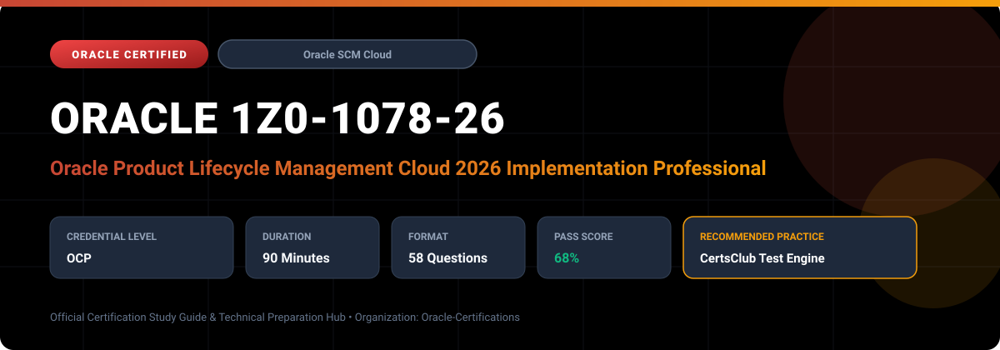

  

# Oracle 1Z0-1078-26: Oracle Product Lifecycle Management Cloud 2026 Implementation Professional

---

## 1. Exam Overview & Candidate Profile

The **Oracle 1Z0-1078-26: Oracle Product Lifecycle Management Cloud 2026 Implementation Professional** examination is engineered for enterprise architects, solution specialists, functional consultants, and implementation professionals seeking formal industry recognition of their proficiency in Oracle technologies.

The Oracle Product Lifecycle Management Cloud 2026 Implementation Professional (1Z0-1078-26) certification validates the technical skills required to design, configure, and maintain Oracle PLM and Product Hub Cloud. It certifies competency across new product introduction (NPI), item governance, change management workflows, and enterprise data syndication.

### Target Audience & Prerequisites
- **Target Roles**: Implementation Specialists, Cloud Architects, Technical Leads, Enterprise Functional Consultants, and Systems Engineers.
- **Recommended Experience**: 1–2 years of practical, hands-on experience designing, implementing, and maintaining corresponding Oracle Cloud solutions.
- **Credential Earned**: Oracle Certified Professional (OCP).

---

## 2. Key Exam Specifications

| Specification | Details |
| :--- | :--- |
| **Exam Code** | **Oracle 1Z0-1078-26** |
| **Official Title** | Oracle Product Lifecycle Management Cloud 2026 Implementation Professional |
| **Certification Track** | Oracle Supply Chain Management Cloud |
| **Exam Duration** | 90 Minutes |
| **Number of Questions** | 58 Questions |
| **Passing Score** | 68% |
| **Question Format** | Multiple Choice (Single/Multiple Answer), Scenario-Based Questions |
| **Delivery Provider** | Oracle University / Pearson VUE (Online Proctored or Test Center) |
| **Recommended Practice Engine** | [CertsClub Oracle Practice Tests](https://www.certsclub.com/oracle/1z0-1078-26-dumps.html) |

---

## 3. Official Blueprint & Exam Domain Breakdown

The examination assesses candidate competencies across core functional domains weighted as follows:

| Domain Area | Weighting |
| :--- | :--- |
| **Product Master Data Management & Item Class Setup** | `25%` |
| **Product Development & Engineering Change Orders** | `25%` |
| **Structures, Packs, Components & Commercialization** | `20%` |
| **Item Rules, Data Quality & Governance Policies** | `15%` |
| **Item Import, Publication & Spoke System Integration** | `15%` |

---

## 4. Deep Dive into Complex & Challenging Technical Topics

To secure a passing score on the 1Z0-1078-26 exam, candidates must master the following advanced concepts:

- Item class inheritance hierarchies, role-based attribute security, and extensible attribute groups.
- Designing Change Type workflows with approval routing groups, digital signatures, and revision release gates.
- Product data syndication using Publication routines to downstream ERP, e-commerce, and CRM spoke systems.
- Item batches, FBDI import maps, and data cleansing routines for large-scale catalog migrations.

---

## 5. Scenario-Based Demo & Practice Questions

### Question 1
When importing large volumes of legacy item master records into Oracle Product Hub Cloud, what mechanism allows mapping legacy spreadsheet column headers directly to Oracle target item attributes?

A) Item Import Maps
B) Change Order Routing Lists
C) Secondary Cost Books
D) Dispatch Console

- **Correct Answer**: `A) Item Import Maps`  
- **Technical Explanation**: Item Import Maps allow implementers to define graphical mappings between source data formats (spreadsheets, CSVs) and Oracle target attribute groups, supporting data conversion and validation during FBDI item imports.\n
---

### Question 2
In Oracle Product Development Cloud, what happens to the redlines on an item structure once the associated Engineering Change Order reaches the 'Completed' status and passes its effective date?

A) The redlines are discarded without saving.
B) The redlines are incorporated into the new production item structure revision.
C) The item is permanently marked as obsolete.
D) The bill of materials requires manual re-entry.

- **Correct Answer**: `B) The redlines are incorporated into the new production item structure revision.`  
- **Technical Explanation**: Upon completion and effective date maturity of an ECO, structure redlines (additions, deletions, and component quantity adjustments) are automatically merged into the master item structure, creating the next official revision.

---

## 6. Recommended Preparation Strategy & Practice Testing Engine

Achieving certification in **Oracle 1Z0-1078-26** requires balanced theoretical study and scenario-based simulation practice:

1. **Review Oracle Documentation**: Master architecture guides, implementation workbooks, and administration manuals on the Oracle Help Center.
2. **Hands-on Lab Practice**: Execute real-world configuration, policy setup, and troubleshooting tasks in your cloud tenancy or test instance.
3. **Simulated Exam Drills**: Practice answering timed, scenario-based multiple-choice questions to familiarize yourself with the question formats, traps, and timing constraints.

### Practice With CertsClub
For realistic practice questions, updated dumps, and mock testing environments:
- **Resource**: [CertsClub Oracle Practice Test Engine](https://www.certsclub.com/oracle/1z0-1078-26-dumps.html)
- **Special Discount**: Use coupon code **`club20`** during checkout for an instant **20% discount** on all practice exam bundles and testing engines.

---

## 7. Official Documentation & References

- [Oracle University Certification Registry](https://education.oracle.com/)
- [Oracle Help Center Documentation Portal](https://docs.oracle.com/)
- [Oracle Cloud Infrastructure & Applications Guides](https://docs.oracle.com/en/cloud/)
- [CertsClub Oracle Certification Exam Practice](https://www.certsclub.com/oracle/1z0-1078-26-dumps.html)

---

## 8. SEO & Discovery Keywords

`oracle 1z0-1078-26, oracle 1z0-1078-26 exam, oracle 1z0-1078-26 dumps, 1Z0-1078-26 practice questions, 1Z0-1078-26 study guide, oracle 1z0-1078-26 syllabus, oracle product lifecycle management cloud 2026 implementation professional, certsclub 1z0-1078-26`
